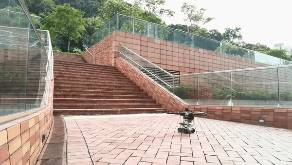

  <iframe src="https://connecthkuhk-my.sharepoint.com/personal/u3009632_connect_hku_hk/_layouts/15/embed.aspx?UniqueId=82d62566-6e4d-40af-8921-c71618c0e676&embed=%7B%22ust%22%3Atrue%2C%22hv%22%3A%22CopyEmbedCode%22%7D&referrer=StreamWebApp&referrerScenario=EmbedDialog.Create" width="640" height="480" frameborder="0" scrolling="no" allowfullscreen title="FastSAM-ROS.mp4"></iframe> 
     

