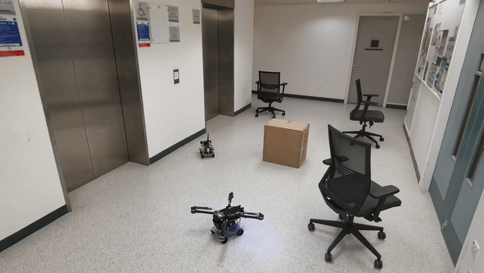

Abstract:
Traditional robots often suffer from limited mobility and functionality, restricting their applications in various fields. To address these limitations, we have designed an innovative integrated multimodal land and air robot that combines advanced features such as voice control, autonomous flight, posture monitoring, and interaction with chatbots. This paper highlights the drawbacks of conventional robots and emphasizes the advantages of our land and air robot, providing a detailed overview of its functionalities in a clear and logical manner.

     

Introduction:
Traditional robots are typically confined to a single mode of operation and often lack the versatility required for diverse applications. This has led to the development of our integrated multimodal land and air robot, which offers enhanced mobility and functionality by combining voice control, autonomous flight, posture monitoring, and interaction with chatbots.

Advantages:
Our land and air robot boasts several advantages over traditional robots, including:
1. Improved mobility through its dual land and air operation modes.
2. Enhanced functionality with advanced features such as voice control and autonomous flight.
3. Real-time posture monitoring using YOLOv8.
4. Seamless interaction with chatbots via ROS1.

Voice Control:
In land mode, the robot utilizes iFlytek's voice module and its offline voice recognition API to recognize command words. This allows users to control the robot's movements through voice commands, providing a more intuitive and user-friendly experience.

Autonomous Flight:
In flight mode, the robot is controlled through command-line instructions. By leveraging MAVROS, the robot sends information to the flight controller, enabling precise and autonomous flight capabilities.

Posture Monitoring:
The robot is equipped with YOLOv8, a state-of-the-art object detection algorithm, to monitor human posture in real-time. 

Interaction with Chatbots:
Using ROS1, the robot can interact with chatbots like ChatGPT, allowing for seamless communication and collaboration between the robot and other AI-powered systems.

Conclusion:
Our integrated multimodal land and air robot addresses the limitations of traditional robots by offering advanced features and enhanced mobility. Its unique combination of voice control, autonomous flight, posture monitoring, and chatbot interaction positions it as a versatile and powerful solution for a wide range of applications.
